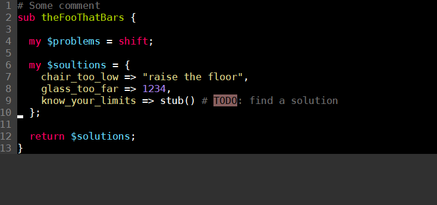

# vim-monokai-night

Monokai color scheme for Vim converted with [coloration](http://coloration.sickill.net) from Textmate theme with the same name, with minor change - make background dark as the night itself.

## Screenshots

## Installation

Put `monokai-night.vim` file in your `~/.vim/colors/` directory and add the following line to your `~/.vimrc`:

    syntax enable
    colorscheme monokai-night
